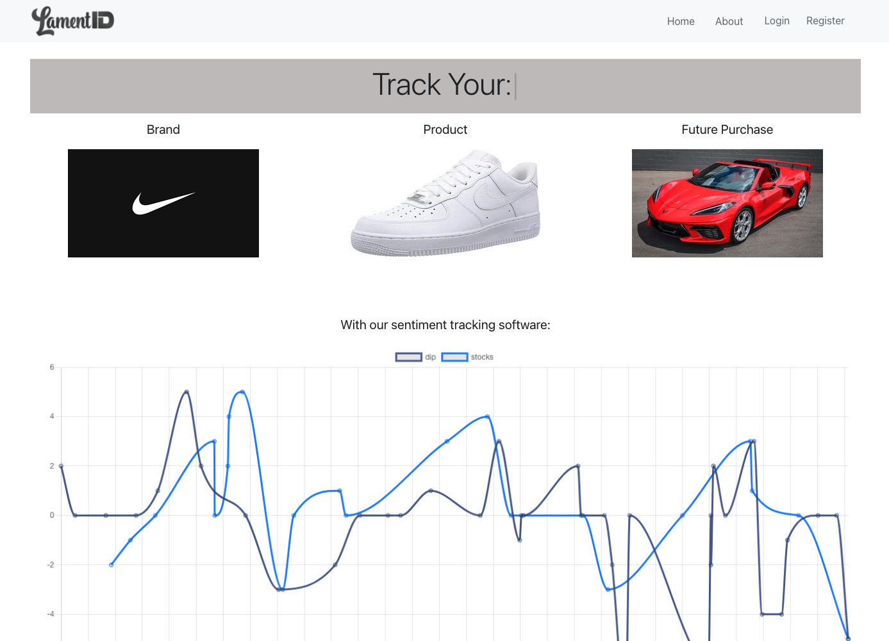
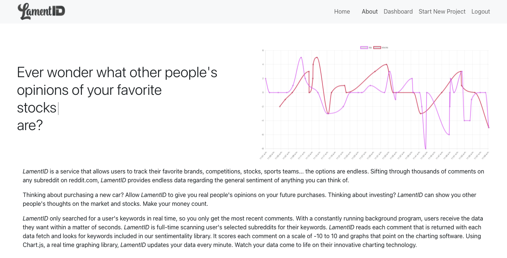
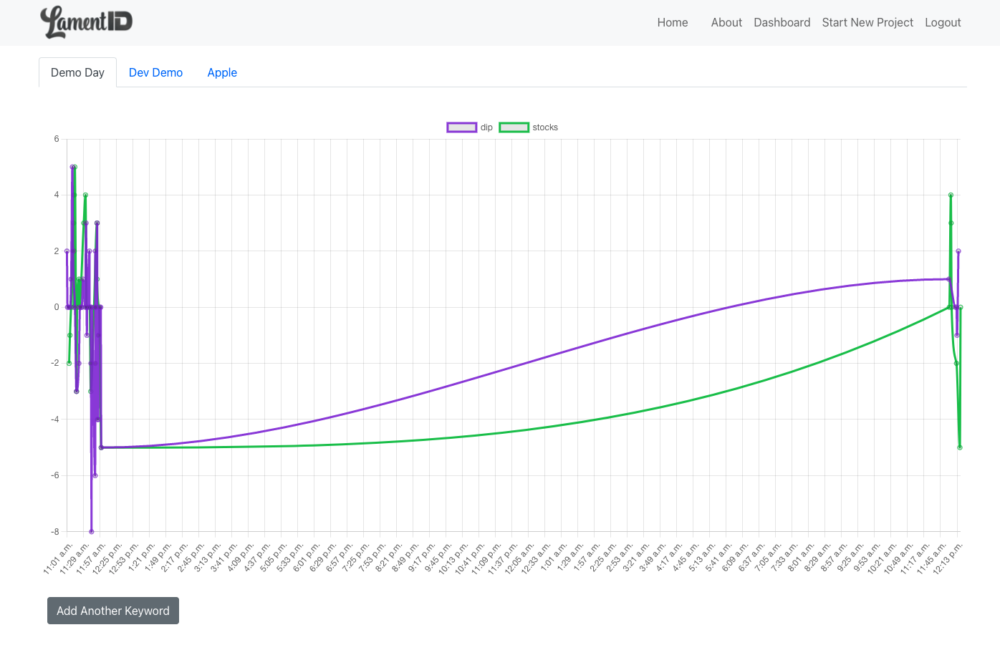
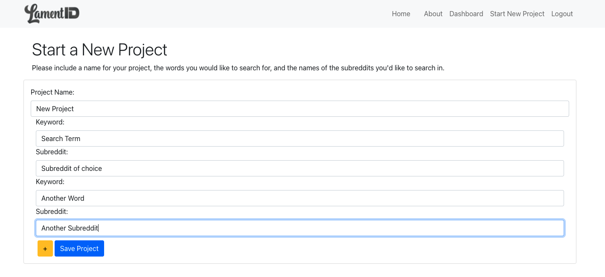

# LamentID

  

 
<h3> <b>Purpose</b> <h3>

LamentID was developed to allow user's to track the general online population's opinion on any one thing. People are able to enter search terms and subreddits, and LamentID scans for the sentimentality of any comments that inclue those search terms. 

<h3><b>Features</b></h3> 

Registration and login availabe for participating users.  
Users have a profile that allows them to see the their searches charted on a line graph and add more search terms/subreddits.

<h3>Separate information pages that are also part of the site:</h3>
- The LamentID landing page includes a chart of previously plotted data to show user's before they sign up what the charts may look like. 
- The about page offers general information about the program and how it works. 
- The new project page allows for users to start a new project after they have signed up, and it allows users to add multiple search terms and subreddits for each project.
  
<h3><b>Languages/Tools Used:</b></h3>
React, Redux, Express, PostgreSQL, Javascript, HTML/CSS, Bootstrap, Heroku
 
<h3><b>Developers:</b></h3>

[Joey Zelinka](https://github.com/JoeyZelinka), [Todd Trowbridge](https://github.com/todd-trowbridge), [Rachel Eisenbrandt](https://github.com/reisenbrandt)
 
<h3><b>Screenshots</b></h3>

<h3>About Page:</h3>

 
<h3>Dashboard Page:</h3>

 
<h3>New Project Page:</h3>

